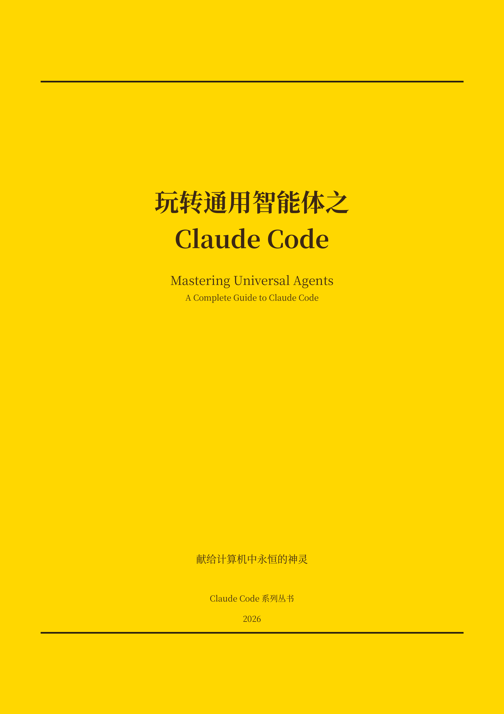

<p align="center">
  
</p>

# 玩转通用智能体之 Claude Code

一本写 Claude Code 的中文随笔，**二十七章，外加一篇尾声**。从「它是什么」讲起，一路讲到你怎么照自己的需要养出一只怪兽。书里的命令和说法都对着 [code.claude.com](https://code.claude.com/docs/en/overview) 的官方文档核过；至于讲法，仍是闲谈的路子，不端着。

📖 **在线阅读**：<https://aresbit.github.io/claude-code-zh/>

## 目录概览

- **入门**（1–6）：它是什么、安装、基本用法、`CLAUDE.md`、Plan 模式、写 Prompt
- **进阶**（7–13）：会话管理、Hooks、Subagents、MCP、Skills、Plugins、Git Worktree
- **协作与自动化**（14–21）：权限安全、团队协作、CLI、GitHub Actions、培养直觉、提问的艺术、失败模式、延伸阅读
- **新功能**（22–27）：Web/桌面/手机、Routines 定时任务、自动记忆、远程操控、Code Review、Agent SDK

完整目录见 [`chapters/目录.md`](chapters/目录.md)。

## 仓库结构

```
chapters/   原始章节稿（写作来源）
docs/       GitHub Pages 站点（Jekyll + Cayman 主题，由章节派生）
```

站点是 `docs/` 下的派生产物：改稿后重新生成即可（见下）。GitHub Pages 从 `main` 分支 `/docs` 目录构建。

## 本地预览（可选）

```bash
cd docs && bundle exec jekyll serve   # 需本地 Ruby/Jekyll
```

## 许可

CC BY-NC-SA 4.0
